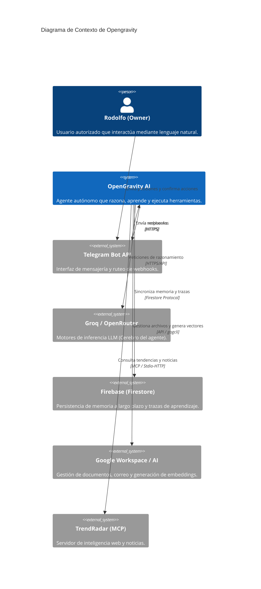

# Arquitectura del Sistema — Opengravity

## Visión General

Opengravity es un **Agente de IA Personal Autónomo** diseñado para ejecutarse en la nube y comunicarse exclusivamente a través de Telegram. Su arquitectura se basa en un **Reasoning Loop** desacoplado que utiliza el **Model Context Protocol (MCP)** para interactuar con herramientas externas.

## Atributos de Calidad

1. **Resiliencia**: Capacidad de conmutación por error (fallback) entre modelos de lenguaje (Groq -> OpenRouter).
2. **Seguridad**: Validación estricta de IDs de usuario y confirmación humana para acciones de escritura/ejecución.
3. **Autoaprendizaje**: Sistema de trazas que permite al agente aprender de sus éxitos pasados (LeJEPA) y fallos auditados.
4. **Eficiencia de Contexto**: Gestión dinámica de tokens mediante ruteo de categorías y truncadura agresiva.

## Diagrama C4 Contexto (Nivel 1)

