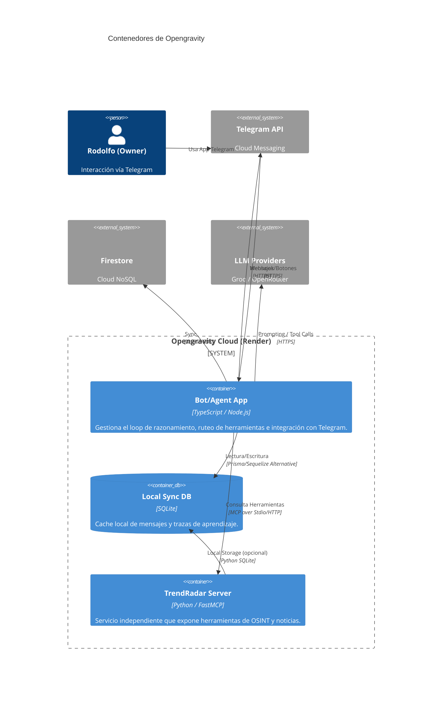

# Diagrama C4 Contenedores (Nivel 2) — Opengravity

```mermaid
C4Container
    title Contenedores de Opengravity

    Person(rodolfo, "Rodolfo (Owner)", "Interacción vía Telegram")

    System_Boundary(c1, "Opengravity Cloud (Render)") {
        Container(agent_app, "Bot/Agent App", "TypeScript / Node.js", "Gestiona el loop de razonamiento, ruteo de herramientas e integración con Telegram.")
        ContainerDb(sqlite_db, "Local Sync DB", "SQLite", "Cache local de mensajes y trazas de aprendizaje.")
        Container(trendradar_mcp, "TrendRadar Server", "Python / FastMCP", "Servicio independiente que expone herramientas de OSINT y noticias.")
    }

    System_Ext(telegram_api, "Telegram API", "Cloud Messaging")
    System_Ext(firestore, "Firestore", "Cloud NoSQL", "Fuente de verdad de memoria y perfil de usuario.")
    System_Ext(llm_providers, "LLM Providers", "Groq / OpenRouter", "Inferencia de lenguaje natural.")

    Rel(rodolfo, telegram_api, "Usa App Telegram")
    Rel(telegram_api, agent_app, "Webhook", "HTTPS")
    Rel(agent_app, telegram_api, "Mensajes/Botones", "HTTPS")
    
    Rel(agent_app, llm_providers, "Prompting / Tool Calls", "HTTPS")
    Rel(agent_app, sqlite_db, "Lectura/Escritura", "Prisma/Sequelize Alternative")
    Rel(agent_app, firestore, "Sync", "Admin SDK")
    Rel(agent_app, trendradar_mcp, "Consulta Herramientas", "MCP over Stdio/HTTP")

    Rel(trendradar_mcp, sqlite_db, "Local Storage (opcional)", "Python SQLite")
```
