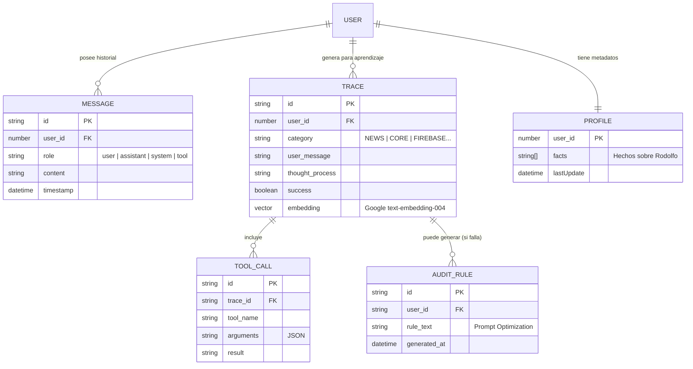

# Diagrama Entidad-Relación (ERD) — Opengravity

Este diagrama consolida las estructuras de datos persistidas tanto en **Firestore** (Nube) como en **SQLite** (Local).

```mermaid
erDiagram
    USER ||--o{ MESSAGE : "posee historial"
    USER ||--o{ TRACE : "genera para aprendizaje"
    USER ||--|| PROFILE : "tiene metadatos"
    
    TRACE ||--o{ TOOL_CALL : "incluye"
    TRACE ||--o{ AUDIT_RULE : "puede generar (si falla)"

    MESSAGE {
        string id PK
        number user_id FK
        string role "user | assistant | system | tool"
        string content
        datetime timestamp
    }

    TRACE {
        string id PK
        number user_id FK
        string category "NEWS | CORE | FIREBASE..."
        string user_message
        string thought_process
        boolean success
        vector embedding "Google text-embedding-004"
    }

    PROFILE {
        number user_id PK
        string[] facts "Hechos sobre Rodolfo"
        datetime lastUpdate
    }

    TOOL_CALL {
        string id PK
        string trace_id FK
        string tool_name
        string arguments "JSON"
        string result
    }

    AUDIT_RULE {
        string id PK
        string user_id FK
        string rule_text "Prompt Optimization"
        datetime generated_at
    }
```
