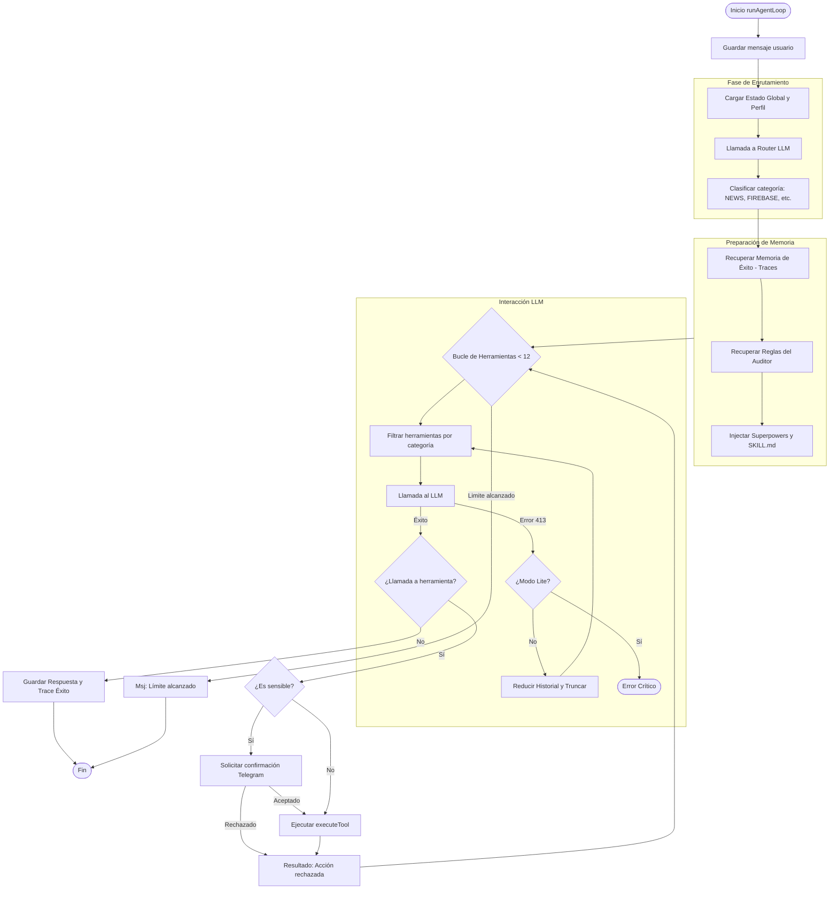

# Reasoning Loop — Detalle de Funcionamiento

Este diagrama detalla la lógica de `src/agent/loop.ts`, incluyendo la recuperación de errores 413 y la estrategia de memoria exitosa.

### Lógica de Autocorrección de Contexto (413)
Cuando el sistema recibe un error `Request Too Large`:
1. El flag `contextReduced` se activa en `true`.
2. El sistema mantiene solo los últimos 2-3 turnos de conversación.
3. Se aplica un truncamiento agresivo (500 caracteres) a cualquier salida de herramienta previa que esté en el historial.
4. Se cambia el System Prompt al `LITE_SYSTEM_PROMPT`.
5. Se reintenta la llamada sin cambiar el modelo.
