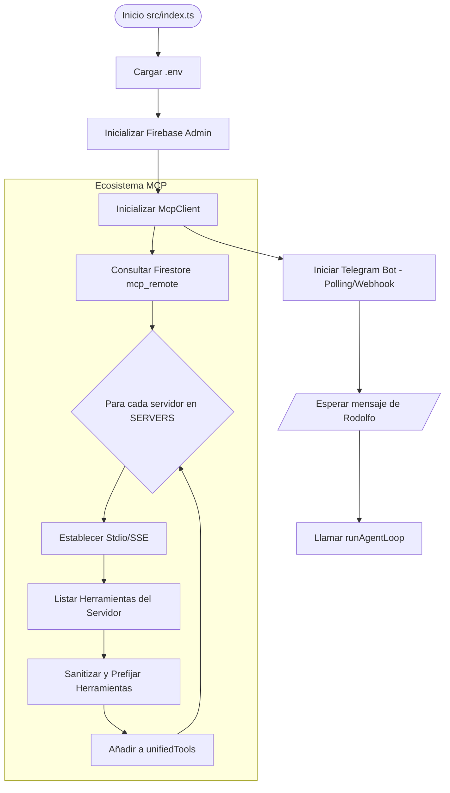
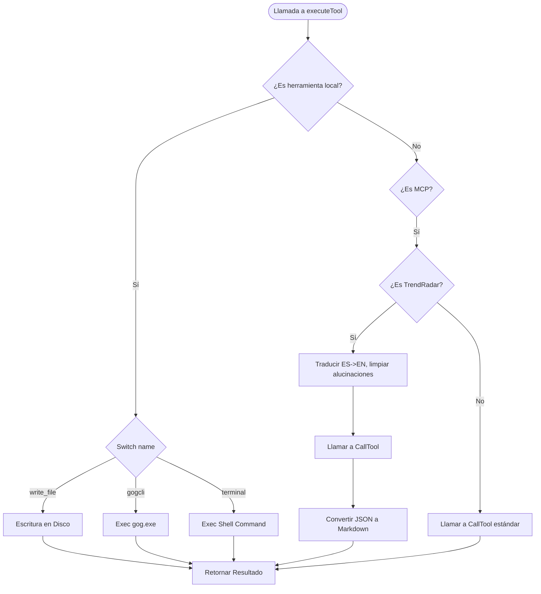

# Diagramas de Flujo — Módulo `agent`

## Orquestación e Inicialización
Este flujo describe el arranque del sistema y la carga del ecosistema de herramientas.

## Ejecución de Herramientas (executeTool)

