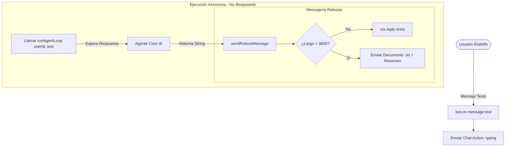
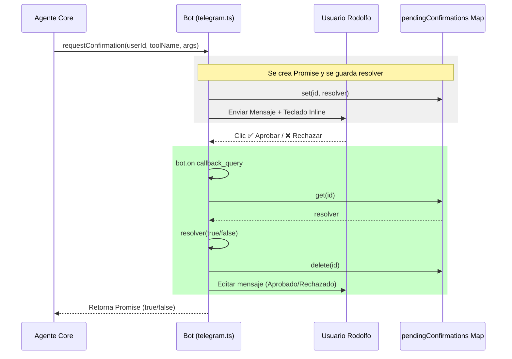

# Diagramas de Flujo — Módulo `bot`

## Ciclo de vida de un mensaje de Telegram

```mermaid
graph TD
    User([Usuario Rodolfo]) -- Mensaje Texto --> BotOn[bot.on message:text]
    BotOn --> Typing[Enviar Chat Action: typing]
    
    subgraph Execution [Ejecución Asíncrona - No Bloqueante]
        RunLoop[Llamar runAgentLoop userId, text]
        RunLoop -- Espera Respuesta --> AgentBrain[Agente Core IA]
        AgentBrain -- Retorna String --> SendMsg[sendRobustMessage]
        
        subgraph RobustSending [Mensajería Robusta]
            SendMsg --> CheckLen{¿Largo > 3800?}
            CheckLen -- No --> Reply[ctx.reply texto]
            CheckLen -- Sí --> FileFallback[Enviar Documento .txt + Resumen]
        end
    end
```

## Sistema de Confirmación (Human-in-the-loop)

```mermaid
sequenceDiagram
    participant Agent as Agente Core
    participant Bot as Bot (telegram.ts)
    participant User as Usuario Rodolfo
    participant Map as pendingConfirmations Map

    Agent->>Bot: requestConfirmation(userId, toolName, args)
    rect rgb(240, 240, 240)
        Note over Bot, Map: Se crea Promise y se guarda resolver
        Bot->>Map: set(id, resolver)
        Bot->>User: Enviar Mensaje + Teclado Inline
    end
    
    User-->>Bot: Clic ✅ Aprobar / ❌ Rechazar
    
    rect rgb(200, 255, 200)
        Bot->>Bot: bot.on callback_query
        Bot->>Map: get(id)
        Map-->>Bot: resolver
        Bot->>Bot: resolver(true/false)
        Bot->>Map: delete(id)
        Bot->>User: Editar mensaje (Aprobado/Rechazado)
    end
    
    Bot-->>Agent: Retorna Promise (true/false)
```
