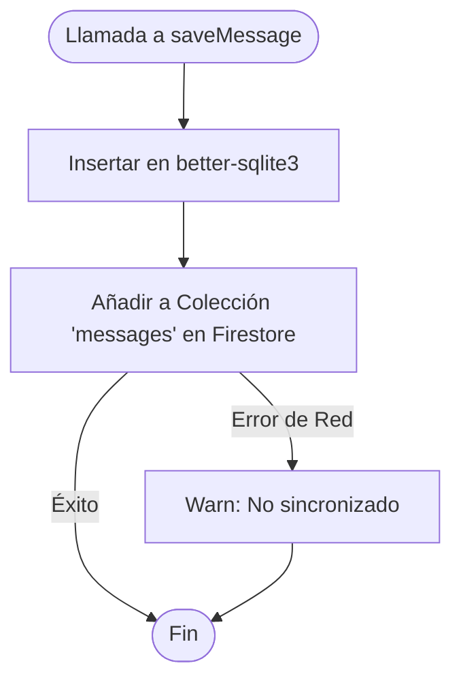
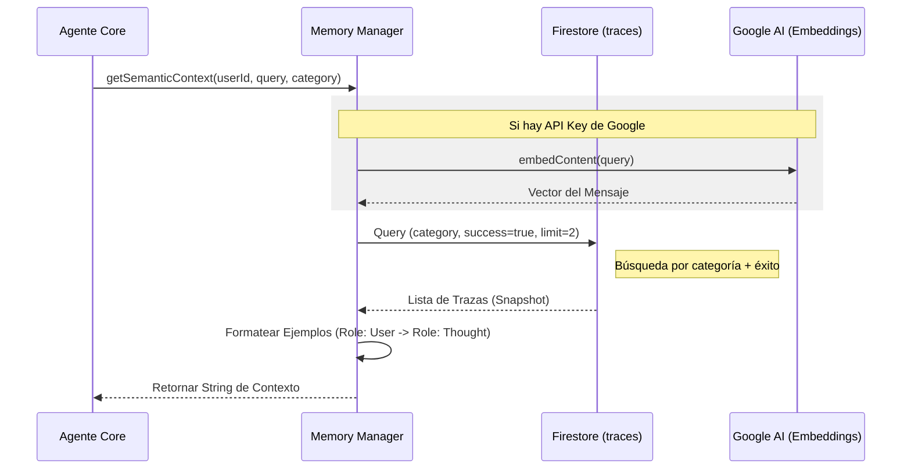

# Diagramas de Flujo — Módulo `memory`

## Flujo de Guardado Híbrido

Este flujo describe cómo se asegura la redundancia de los mensajes del bot.

## Memoria Semántica y LeJEPA

Cómo el agente recupera ejemplos de éxito para guiar su razonamiento.

