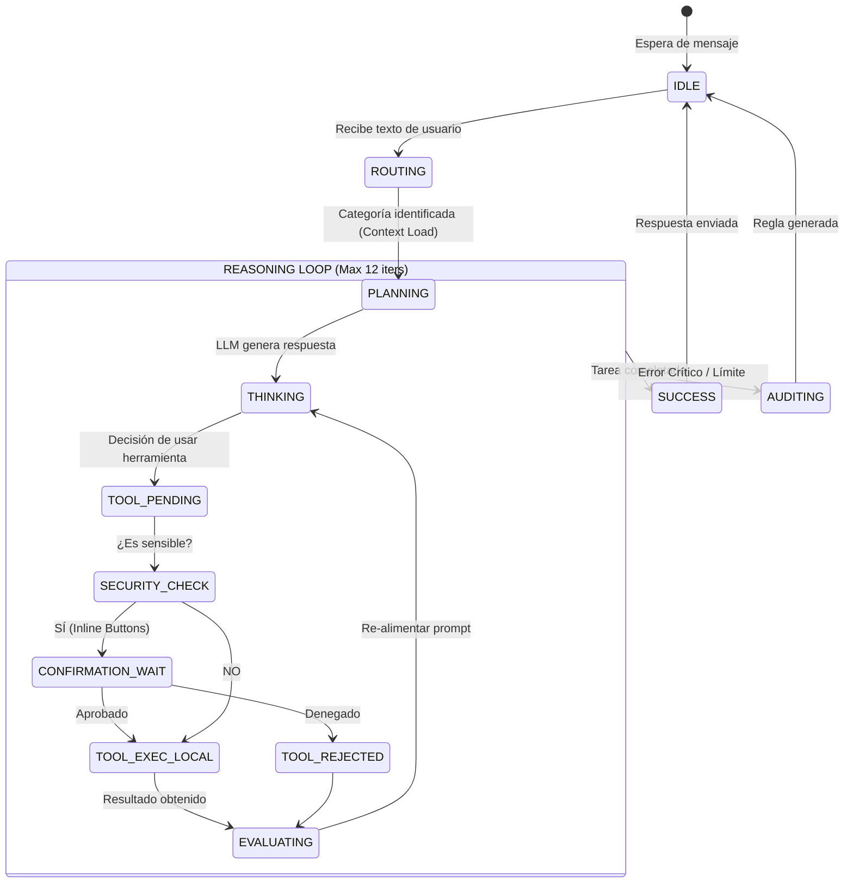
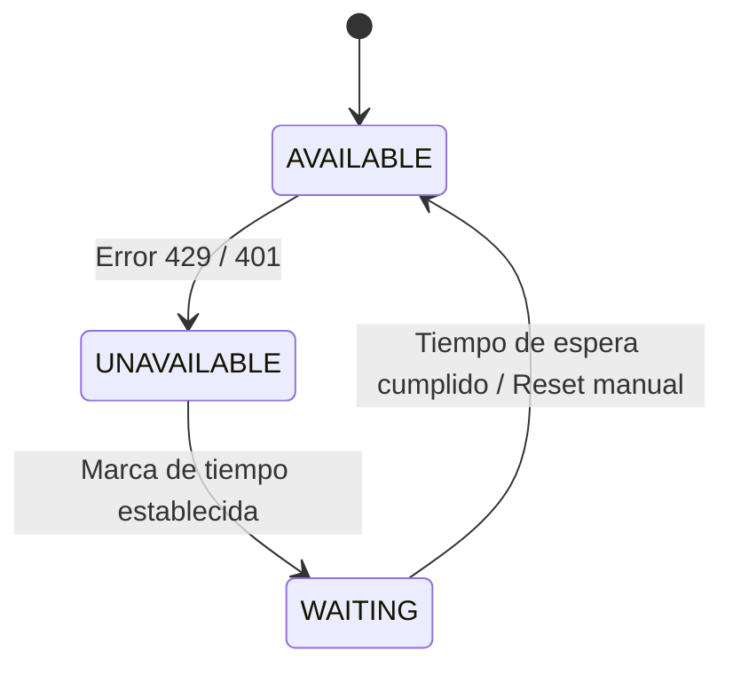

# Máquinas de Estado — Opengravity

## Ciclo de Vida de una Petición (Agent Loop)

Este diagrama describe el estado lógico del agente mientras procesa un mensaje desde Telegram.

## Estados de los Modelos (Model Visibility)

Gestionado por `ModelTracker`.

